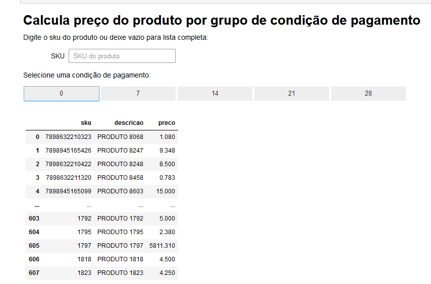
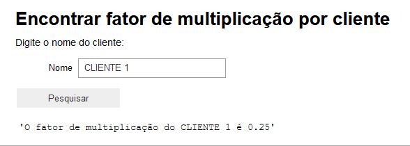
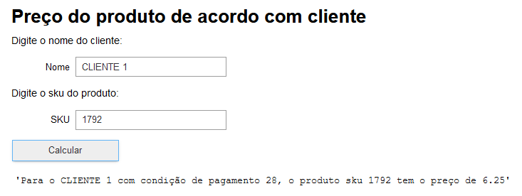

# Teste-Mentors

### Funções

Existem três funções:

1. Retorna a lista de produtos com preço de acordo com a condição de pagamento selecionada;

   
   
2. Retorna o fator de mutiplicação de determinado cliente;

   
   
3. Retorna o preço do produto determinado de acordo com o cliente selecionado.
   
   

Clique no box de codigo e depois clique em Run.

### Acesso

O teste está rodando em uma VM.

Para testar, crie o login e senha no [link](http://34.151.208.60) (salva primeira senha digitada).

Agora acesse o teste [aqui](http://34.151.208.60/hub/user-redirect/git-pull?repo=https://github.com/LucasTieni/Teste-Mentors&branch=main&subPath=TesteMentors.ipynb&app=notebook).

